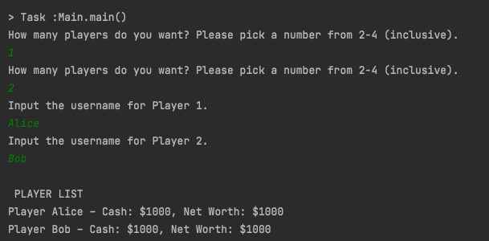

# Progress Report Phase 0

This is our progress report as of Phase 0. We wish to add more details as we start getting into conceiving how we will
implement various components of the program.

We also hope this becomes a physical evidence on how much we've progressed throughout the term and push us further
into collaborative developing.

## Specification
Our goal is to create a simplified version of the popular real-estate board game, Monopoly. Players participate in a
game with up to three other players. Before the game begins, players can set a net worth goal and a maximum number of
rounds. The objective of the game is to be the first player to reach this net worth goal within the specified maximum
number of rounds. If all but one player has gone bankrupt, the remaining player wins. Each player starts
with $1000 in cash and players take turns rolling a die, moving across the board, interacting with special board tiles
(Jail, Auction, Surprise tiles), paying rent to other players, and buying, selling, auctioning, trading, and upgrading
properties (cities and public properties) until the game ends.

## CRC Model

**User Interface**: `CMDLineUI` takes in inputs from the user.

**Controller**: `controllers.GameController` controls the game state by responding to the user inputs and performs business
operations by passing it to use case interactor.

**Use Case Interactors**: `usecases.PropertyManager`, `MoneyManager`, `usecases.BoardManager`, and `AuctionManager` takes input from
the controller and access entities such as `entities.Tile`, `entities.Board`, `entities.Player`, etc.

**Entities**: `entities.Tile`, `entities.Board`, `entities.Player`, and many more classes act as the entities where they represent the domain of
our game.

## Scenario Walkthrough
When the program is run, the command line (`details.CmdLineUI`) prompts the user to input the numbers of players in the game
(between 2 to 4 inclusive). Next, it asks the user to enter the usernames of each player.
Then the `controllers.GameController` starts and runs the game. At the beginning of a game, the `controllers.GameController` works with the
`usecases.BoardManager` to initialize the players (`entities.Player` objects) and put the players in the starting locations.
Once this is set up, a string containing the `name`, `cash`, and `netWorth` of each player
(the respective attributes of the `entities.Player` objects) is displayed.

## Skeleton Program
For this program, we implemented `details.CmdLineUI` (framework), `controllers.GameController` (controller), `usecases.BoardManager`(use case interactor),
`entities.Player` and `entities.Token` (both entities). In main.Main.java, we create an instance of our `controllers.GameController` and our `details.CmdLineUI`.
We call `details.CmdLineUI`’s **runPlayerSetup()** to prompt the user for the total number of players and the usernames of each player
and to call the controller’s **runPlayerSetup()** method. The `controllers.GameController` stores an instance of `usecases.BoardManager`, whose
**addPlayers()** method is called to construct a new `entities.Player` with each username. Then, we print a string representation of
the controller’s `usecases.BoardManager` from the *runPlayerSetup()** method, which contains a list of the players as described in the
walkthrough.

- ### Skeleton Program Output
 

## Contribution

- **Jacqueline**: Worked on specification and skeleton program. Going forward, will continue to refine CRC model and gradually implement remaining classes/interfaces.

- **Danny**: Worked on specifications and CRC cards. Will continue to implement classes & interfaces in order to ensure smooth
interactions between classes.
- **Steve**: Worked on specifications and CRC cards. Will continue to implement necessary parts of the program and make sure our program is congruent to clean architecture modelling.
- **Parth**:Worked on CRC cards and walkthrough. Will continue to implement classes & interfaces in order to ensure smooth interactions between classes.
- **Anis**: Worked on CRC cards and skeleton program. Will continue to refine CRC model and implement remaining 
- classes/interfaces according to the principles of clean architecture
- **Samooj**: Worked on unit tests and CRC cards. Will continue to refine CRC model and implement classes/interfaces.

## What worked out

After writing down our specification, we started to make CRC card based on the choices of nouns and verbs we used in
describing our specification. At first, we had no idea how to start these off but soon enough, we had over 20 cards
created and identified as **Controller**, **Use Case**, **Entities**, etc. Everyone had participated in an enthusiastic manner and contributed
many ideas.
- We have different use cases handling different needs of the program
(such as `usecases.PropertyManager`, `usecases.BoardManager`, `AuctionManager`, and `MoneyManager`) and they all have low coupling and high
cohesion, which is desired.
- Clear separation of classes into entities, use cases, controllers, and UI according to the dependency rule and the
principles of clean architecture.
- Use of inheritance for `tiles`, `properties`, `cities`, and public properties aligns well with our intuitive understanding of
the relationships between these objects in a standard Monopoly game.

## Obstacles
1. We are having some issues with IntelliJ and test cases clashing with gradle for which we had to find a fix in settings
through stack overflow, is this supposed to happen or did we mess something up.
2. Whether use cases can interact with other use cases, or should the controller interact with them.
